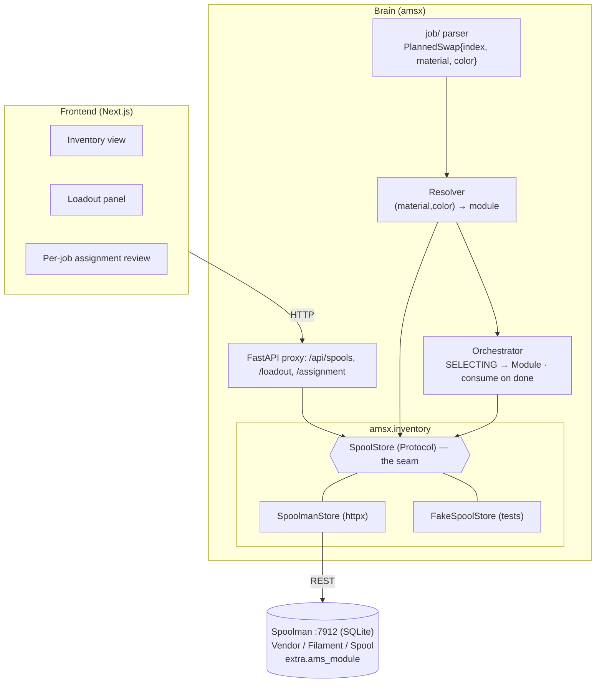

# Spool Inventory & Spoolman Integration — Design

**Date:** 2026-06-25 (rev. 2 — Spoolman-direct)
**Status:** Approved structure + key decisions; pending spec review → implementation plan
**Scope:** How AMS-X learns *what filament is which* and *which physical spool sits in which
module*, so a parsed swap resolves to a module by **color/material identity** — using a **running
Spoolman instance as the inventory source of truth from day one** (no interim local store).

---

## 1. Problem

A `PlannedSwap` carries only `filament_index` — the slicer's `M1020 S<n>` slot, which on the
external spool is **always 0** (confirmed live: the color change is implicit in the human swap).
It has **no color or material**, and the module it maps to is a *static* `filament_index →
module_id` table. To say *"red goes in module 2"* the Brain needs two things it lacks:

1. **Filament identity** per change (the swap must know it means *PLA #E03B24 / red*).
2. **An inventory**: which physical spool (material/color/remaining) is loaded in which module,
   editable by the operator and persisted.

Spoolman already solves #2 as a service. This design wires it in directly.

## 2. What Spoolman gives us (grounded in the running instance)

Probed live: **Spoolman 0.23.1 at `http://localhost:7912/api/v1`, SQLite, no auth, CORS-configurable.**

- **`Vendor → Filament → Spool`.** **Filament** holds `material` + `color_hex` (+ `name`,
  `density`, `diameter`, `multi_color_hexes`). **Spool** is a physical roll of one Filament, with
  `remaining_weight` (computed), `location`, `archived`, and **`extra`** custom fields.
- **Native color match:** `GET /filament?material=PLA&color_hex=E03B24&color_similarity_threshold=20`
  → nearest filament. (Resolves the old "exact vs nearest color" question — Spoolman does it.)
- **Consume:** `PUT /spool/{id}/use {use_weight: grams}` decrements a spool.
- **Custom fields:** per-entity `extra`; each key must be pre-defined via `POST /field/spool/<key>`.
- **No auth**, so integration is a plain HTTP client; CORS via `SPOOLMAN_CORS_ORIGIN`.

## 3. Decisions locked

| Decision | Choice | Why |
|---|---|---|
| Inventory source | **Spoolman-direct from day one** (no local-store phase) | Spoolman supports everything we need; one source of truth |
| The seam | `SpoolStore` Protocol + `SpoolmanStore` (httpx) + `FakeSpoolStore` (tests) | Keeps the Brain testable without a live Spoolman; mirrors `PrinterLink`/`FtpClient` |
| Loadout storage | Spool **`extra.ams_module`** (choice field, auto-created on startup) | Semantic; leaves `location` free for real storage; filter client-side (small N) |
| Frontend ↔ Spoolman | **Proxied through AMS-X** | One API surface, no CORS juggling, loadout/resolve logic in one place |
| Usage tracking | **In scope** — `PUT /spool/{id}/use` after a print, grams from the 3mf | Keeps Spoolman's remaining-weight accurate from the start |
| Color matching | Spoolman's `color_similarity_threshold` | Don't reinvent nearest-color |

## 4. Architecture



The Brain depends only on `SpoolStore`. Production wires `SpoolmanStore`; tests wire
`FakeSpoolStore` (no live Spoolman needed).

## 5. Model mapping (AMS-X ↔ Spoolman)

| AMS-X concept | Spoolman | Notes |
|---|---|---|
| A printable color | **Filament** | `material` + `color_hex` |
| A physical roll on a module | **Spool** (→ Filament) | what the operator loads |
| Loadout (module → spool) | Spool **`extra.ams_module`** = `"m2"` | one-time field def; empty = not loaded |
| Remaining filament | Spool `remaining_weight` | computed by Spoolman |
| Usage after a print | `PUT /spool/{id}/use` | grams from the 3mf |

**Resolve a swap:** job change needs `(material, color)` → `GET /filament?material&color_hex&threshold`
→ candidate Filament(s) → list that filament's Spools whose `extra.ams_module` is set → the module.
Outcomes: **matched** (one module), **ambiguous** (operator disambiguates), **gap** (no loaded spool
matches → human "load X" prompt, today's behavior).

## 6. Components (units)

### 6.1 `amsx.inventory` (new package)
- **`Spool`** value object (a flattened view for the Brain): `id`, `filament_id`, `material`,
  `color_hex`, `name`, `remaining_g`, `module: ModuleId | None`, `archived`.
- **`SpoolStore` Protocol:**
  ```python
  async def list_spools(self, *, include_archived=False) -> list[Spool]: ...
  async def get_spool(self, spool_id: str) -> Spool | None: ...
  async def loaded_in(self, module_id: ModuleId) -> Spool | None: ...      # extra.ams_module == m
  async def set_module(self, spool_id: str, module_id: ModuleId | None) -> None: ...
  async def match_filament(self, material: str, color_hex: str) -> list[str]: ...  # filament ids
  async def consume(self, spool_id: str, grams: float) -> None: ...        # PUT /use
  async def ensure_module_field(self, module_ids: list[ModuleId]) -> None: ...  # POST /field/spool
  ```
- **`SpoolmanStore`** — async httpx client to `{base_url}` (config). Maps Spoolman JSON →
  `Spool`; reads/writes `extra.ams_module`; calls the color-match + consume endpoints; idempotently
  defines the `ams_module` choice field on startup.
- **`FakeSpoolStore`** — in-memory, for unit tests (no live Spoolman).

### 6.2 `amsx.job` — filament identity (metadata, CONFIRMED)
The sliced `.gcode.3mf` carries the full color plan — confirmed on a real manual external-spool
slice (`mode=MultiAsSingle`). Sources, cleanest first:
- **`Metadata/custom_gcode_per_layer.xml`** — one `<layer top_z=.. extruder=N color="#HEX"
  gcode="tool_change"/>` per color change. `round(top_z / layer_height)` → the change's LAYER
  (e.g. `top_z 0.4` → layer 2), which aligns 1:1 with our parsed `M400 U1` layers. This is the
  per-change color source.
- **`Metadata/filament_sequence.json`** — `{plate: {sequence: [1,5,…]}}`, the ordered filament ids;
  index 0 is the **BASE** color loaded at print start, the rest are the changes.
- **`Metadata/slice_info.config`** — the filaments actually used: `<filament id type color
  used_g/>` → material + hex + **grams** (the data for consume tracking, §6.5).
- **`Metadata/project_settings.config`** — full palette arrays (`filament_colour`, `filament_type`).

`job/` produces an ordered **color plan keyed by filament index** — the slicer's filament id, taken
from `custom_gcode_per_layer.xml`'s `extruder` attribute (+ `filament_sequence` for the base). Each
`PlannedSwap` carries that **index**, which is now meaningful (unlike `M1020`, always `S0` on the
external spool), and a side map holds `index → (material, color, grams)`. The operator's assignment
is keyed by the same index (`index → module`), so at runtime a pause binds **pause → index →
module**. Color is for the UI swatch + the pre-fill only. Best-effort: missing metadata degrades to
the index-only human prompt.

### 6.3 Resolver (best-effort pre-fill only)
`propose(swap) -> module | None` — a **best-effort** suggestion via `SpoolStore.match_filament` +
`loaded_in` (nearest loaded color via Spoolman's `color_similarity_threshold` — proper colour-
distance, so we never hand-roll hex-prefix matching). It only **pre-fills** the mapping UI; the
operator's confirmed
assignment is authoritative and may override it (or map several colors to one module). Deliberately
*not* clever: **no auto-assignment guarantees and no Spoolman delta-sync** — we query Spoolman when
we need it and let the user assign. Keeps the static `for_filament_index` as the fallback when no
identity is available.

### 6.4 Per-job filament mapping — Bambu-style, editable (`amsx.orchestration` + API)
After upload+parse, AMS-X computes the **auto-match**: each **distinct color the job uses** → the
module whose loaded spool matches (Spoolman color match), returned as an **editable mapping** (a row
per job-color). The frontend renders it like Bambu Studio's filament panel and the operator can
**reassign or fill gaps before the print starts** (start is gated on confirming the mapping). Two
kinds of edit:
- **Reassign to an already-loaded module** → per-run binding only; the standing loadout is unchanged.
- **Fill a gap / pick a different spool** ("I'll load this color into module X") → this *updates the
  standing loadout* in Spoolman (`set_module` on that spool), because the physical state changed.

The confirmed `color → module` mapping gates start and drives SELECTING. Granularity is per distinct
color (not per individual `M400 U1`); the cursor still sequences the changes at run time, and we
never touch the gcode — the mapping is internal (color/filament **index → module**).

The **same spool/module may be assigned to multiple rows** — if one physical spool covers two of the
job's colors, or the operator just has it loaded, that's allowed, not an error (no uniqueness
constraint). The operator's confirmed mapping is **authoritative**; auto-match is only a convenience.

### 6.5 Usage tracking
On print completion (or per accepted swap), `consume(spool_id, grams)` where grams come from the
3mf's per-filament `used_g`. Decrements Spoolman's remaining weight.

### 6.6 FastAPI proxy + config
AMS-X exposes inventory/loadout/assignment endpoints (frontend never talks to Spoolman directly).
New config: `spoolman.base_url` (default `http://localhost:7912/api/v1`), timeout. On startup the
Brain calls `ensure_module_field(configured module ids)`. If Spoolman is unreachable, inventory
endpoints surface a clear error; the swap loop still runs (degrades to human prompts).

### 6.7 Printer external-spool filament sync (`vt_tray`) — CONFIRMED live (2026-06-25)
Bambu tracks the external spool as a **virtual tray** (`vt_tray`). Both directions verified on the
A1 mini:
- **Read (seed/confirm the BASE):** `print.vt_tray` reports `tray_color` (RRGGBBAA hex), `tray_type`
  (e.g. `PLA`), `tray_info_idx` (Bambu profile, e.g. `GFL04`), `nozzle_temp_min/max`. At arm we read
  it and **pre-fill the base-color row** — the base is already loaded; the operator just confirms.
- **Write (on swap):** push the new filament with `ams_filament_setting` (color set + restored live):
  ```json
  {"print": {"command": "ams_filament_setting", "sequence_id": "..",
             "ams_id": 255, "tray_id": 254, "slot_id": 0,
             "tray_info_idx": "GFL04", "setting_id": "",
             "tray_color": "RRGGBBFF", "tray_type": "PLA",
             "nozzle_temp_min": 190, "nozzle_temp_max": 240}}
  ```
  `ams_id=255` + `tray_id=254` = the external spool (BambuStudio's values; pybambu's `tray_id=0` was
  NOT needed on the A1). `tray_color` is 8-hex UPPERCASE; `tray_info_idx`/`setting_id` may be `""`
  for a custom color. The A1 fails **silently** on a malformed command, so we read `vt_tray` back to
  confirm it stuck.

Lives in the printer/driver layer (`parse_external_filament` + `request_set_external_filament`).

## 7. Data flow — arming a job

```mermaid
sequenceDiagram
    actor Op as Operator
    participant FE as Frontend
    participant API as AMS-X API
    participant Res as Resolver
    participant Store as SpoolmanStore
    participant SPM as Spoolman

    Op->>FE: upload sliced .3mf
    FE->>API: POST /job?start=false
    API->>Res: resolve each distinct (material,color)
    Res->>Store: match_filament + loaded_in
    Store->>SPM: GET /filament?color_hex.. ; GET /spool
    SPM-->>Store: filament + loaded spools
    Store-->>Res: module per color (or gap)
    Res-->>API: assignment proposal
    API-->>FE: review (suggestions + gaps)
    Op->>FE: confirm / override / load missing
    FE->>API: POST /job/assignment
    Note over API: Orchestrator SELECTING uses confirmed module; on print done, consume() per spool
```

## 8. API surface (AMS-X proxy — new)

| Method | Path | Purpose |
|---|---|---|
| `GET` | `/api/spools` | Inventory (proxied list, with `module` resolved from `extra.ams_module`) |
| `GET` | `/api/printers/{id}/loadout` | Which spool is in each module |
| `PUT` | `/api/printers/{id}/loadout` | Set a module's loaded spool (`set_module`) |
| `GET` | `/api/printers/{id}/job/assignment` | Proposed per-job assignment after arm |
| `POST` | `/api/printers/{id}/job/assignment` | Confirm/override the assignment |

(Spool/Filament CRUD stays in Spoolman's own UI for v1; AMS-X reads + sets `ams_module` + consumes.)

## 9. Frontend surfaces
- **Inventory view** — spools from `/api/spools` (color swatch, material, remaining).
- **Loadout panel** — per printer, set which spool sits in each module.
- **Per-job filament mapping (Bambu-style)** — shown right after upload/parse and *before* start:
  one row per distinct job-color (swatch + material) auto-matched to a module/spool, each
  **editable** (reassign module, or resolve a **gap** by choosing a module to load). "Confirm &
  Start" gates the print on the mapping. This is the primary "anyone can use it" surface.

## 10. Error handling / edge cases
- **Gap (color not loaded):** assignment flags it; operator loads + sets the module, or the run
  falls back to the existing human prompt — never a silent guess.
- **Ambiguous (two loaded spools match):** operator disambiguates.
- **No identity in 3mf:** swap stays index-only → today's behavior.
- **Spoolman down:** inventory/assignment endpoints error clearly; the swap loop still runs on
  human prompts. (No hard dependency on Spoolman for the core loop.)
- **Single-brain:** AMS-X sets `ams_module`/consumes only on operator action or confirmed swaps,
  never inferred from the printer.

## 11. Testing
- `amsx.inventory`: `FakeSpoolStore` unit tests; `SpoolmanStore` against a mocked Spoolman REST
  (recorded payloads from the live 0.23.1 schema).
- `job/`: identity extraction from a fixture **manual-external-spool** 3mf (the §6.2 spike output).
- Resolver: matched / ambiguous / gap.
- Assignment: arm → proposal → confirm → SELECTING uses the bound module (simulator).
- Consume: print-done → `use_weight` called with the right grams.

## 12. Milestones (single phase, incremental)
- **M1 — inventory plumbing:** `SpoolStore` + `SpoolmanStore` + `ensure_module_field` + proxy
  endpoints + frontend inventory/loadout panel. Operator sees Spoolman spools and sets loadout.
- **M2 — identity + resolve + assignment:** 3mf metadata extraction (after the §11 spike),
  resolver, per-job assignment review, SELECTING uses the confirmed module.
- **M3 — usage tracking:** consume grams on print completion.

## 13. Parked — record now, build later (explicit TODOs, not in the first cut)

- **Inventory management *inside* AMS-X** (big TODO): proxy create/edit of Spoolman filaments +
  spools through the AMS-X frontend, so operators never have to open Spoolman's own UI. The proxy
  (§6.6) is read + tag + consume in the first cut; this extends it to full CRUD later.
- **Runout → backup spool (not just color change):** an AMS swaps on *runout*, not only on color.
  With external modules you can keep the **same filament on two modules** (primary + backup); when
  one runs out we switch to the backup spool — *same color, different module*. Plan: let **Bambu
  detect runout** (its alert / the printer's filament sensor); on that signal, if a same-filament
  backup is loaded, prompt the operator to continue from it. Implication for the model: a color may
  map to a primary **and** a backup module, and the mapping UI should tolerate duplicate-filament
  loadouts (which §6.4 already allows).

## 14. Open questions (for spec review)
- **Identity spike — RESOLVED (§6.2):** `custom_gcode_per_layer.xml` ties each change to its color +
  layer, `filament_sequence.json` gives the base color, `slice_info.config` gives grams. Confirmed
  on a real `MultiAsSingle` slice. Remaining detail: handle multi-change-per-layer ordering if a
  layer ever carries two `tool_change` entries (rare).
- **Base color — RESOLVED:** it's a mappable row the operator assigns, **pre-filled from the
  printer's current external filament** (§6.7) so they confirm rather than re-declare.
- **`vt_tray` sync — CONFIRMED (§6.7):** read `print.vt_tray` for the base; write via
  `ams_filament_setting` (`ams_id=255`, `tray_id=254`) — verified live 2026-06-25.
- Per-swap consume vs whole-print consume (lean: whole-print, simpler + matches the 3mf's `used_g`).
