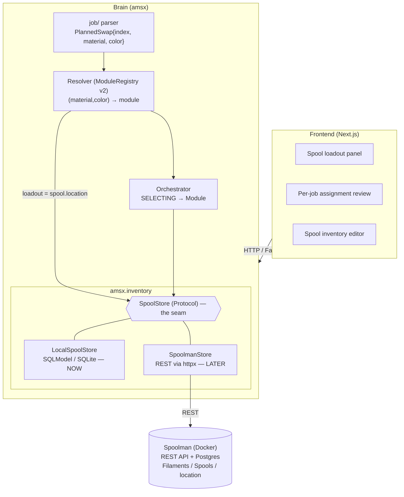
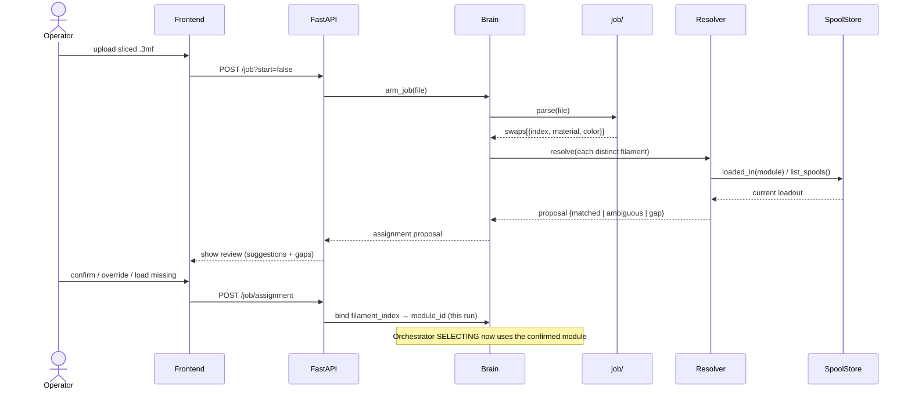

# Spool Inventory & Spoolman Integration — Design

**Date:** 2026-06-25
**Status:** Approved structure; pending spec review → implementation plan
**Scope:** How AMS-X learns *what filament is which* and *which physical spool sits in which
module*, so a parsed swap can resolve to a module by **color/material identity** instead of a
hardcoded slot map — with a per-job assignment flow for v0 now and Spoolman as the persistent
inventory later, both behind one seam.

---

## 1. Problem

Today a `PlannedSwap` carries only `filament_index` — the slicer's `M1020 S<n>` slot number. It
has **no color or material**, and the module it maps to is a *static* `filament_index → module_id`
table (`ModuleRegistry`). The human is simply prompted "swap now". To say *"red goes in module 2"*
— and eventually to automate it — the Brain needs two things it lacks:

1. **Filament identity** on each swap (the swap must know it means *PLA #E03B24 / red*).
2. **An inventory**: which physical spool (with its material/color/our-own-id) is loaded in which
   module, persisted and editable by the operator.

The architecture already anticipates this: `ModuleRegistry` is documented *"Config map now;
Spoolman material match later,"* and `FilamentRef` already reserves a `spool_id` field.

## 2. Goals / Non-goals

**Goals**
- Attach real filament identity (material + color) to every parsed swap.
- A persistent **spool inventory** the operator edits from the frontend.
- A **resolver** that maps a swap's identity → the module whose loaded spool matches.
- A **per-job assignment** step: propose modules from the current loadout; let the operator
  confirm / override / fill gaps before the run.
- One **`SpoolStore` seam** so v0 runs with a local store now and Spoolman drops in later with no
  change to the resolver, orchestrator, or frontend.

**Non-goals (deferred)**
- Standing up Spoolman + Postgres (Phase B).
- Automated (motorized) selection — v0 still uses the human-backed `ManualModule`; this design
  only makes the Brain *know* the correct module/color and validate it.
- Filament usage/weight accounting (`consume`) — interface reserved, wired in Phase B.

## 3. Decisions locked

| Decision | Choice | Why |
|---|---|---|
| Inventory model | Per-job assignment **now**, Spoolman **later**, coexisting | v0 proof-of-concept first; Spoolman is the eventual source of truth |
| Persistence/ORM | **SQLModel**, SQLite now → Postgres later (URL swap only) | Native to FastAPI stack, type-safe, one-line backend change |
| Loadout location | Stored as the spool's **`location`** field (`"<printer>/<module>"`) | Single source of truth; matches Spoolman's own `location` field |
| The seam | `SpoolStore` Protocol + `LocalSpoolStore` / `SpoolmanStore` | Mirrors existing `PrinterLink`/`FtpClient` simulated-vs-real pattern |
| Diagram | Mermaid in this spec | Accurate, legible, version-controlled |

## 4. Architecture



The Brain depends only on `SpoolStore`. Phase A wires `LocalSpoolStore`; Phase B wires
`SpoolmanStore` — nothing upstream changes.

## 5. Components (units)

Each unit: **what it does / its interface / what it depends on.**

### 5.1 Filament identity extraction — `amsx.job`
- **Does:** in addition to the swap plan, read `Metadata/project_settings.config` (JSON) from the
  sliced 3mf for `filament_type[]` and `filament_colour[]`, and attach `material` + `color` to each
  `PlannedSwap` by indexing those arrays with the swap's `filament_index`.
- **Interface:** `PlannedSwap` gains `material: str | None`, `color: str | None` (in `amsx.types`).
  Identity is best-effort: if the metadata is absent/unparseable, fields stay `None` and the system
  falls back to index-only + the existing human prompt.
- **Depends on:** stdlib `zipfile`/`json` only (job/ stays a leaf).
- **Open item:** confirm the index alignment between `M1020 S<n>` and the `filament_colour[]`
  position against a real Bambu sliced 3mf (likely `S<n>` ↔ array[n]); covered by a fixture test.

### 5.2 Inventory value objects + seam — `amsx.inventory` (new package)
- **`Spool`** (frozen dataclass): `id: str`, `material: str`, `color_hex: str`, `name: str | None`,
  `remaining_g: float | None`, `location: ModuleId | None`, `vendor: str | None`.
- **`SpoolStore` Protocol:**
  ```python
  async def list_spools(self) -> list[Spool]: ...
  async def get_spool(self, spool_id: str) -> Spool | None: ...
  async def loaded_in(self, module_id: ModuleId) -> Spool | None: ...   # reads location
  async def set_location(self, spool_id: str, module_id: ModuleId | None) -> None: ...
  async def upsert(self, spool: Spool) -> Spool: ...                    # v0 inventory editing
  async def consume(self, spool_id: str, grams: float) -> None: ...     # Phase B no-op now
  ```
- **Depends on:** nothing upstream; implementations depend on their backend.

### 5.3 `LocalSpoolStore` (Phase A) — `amsx.inventory.local`
- **Does:** the `SpoolStore` over a **SQLModel** `SpoolRow` table in SQLite (`amsx.db`). The
  `location` column is the loadout. Survives restarts; editable via the API/frontend.
- **Depends on:** SQLModel, a session/engine factory (`amsx.db`).
- **Postgres path:** identical models; change only the connection URL (Phase B option even without
  full Spoolman).

### 5.4 `SpoolmanStore` (Phase B) — `amsx.inventory.spoolman`
- **Does:** the `SpoolStore` over Spoolman's REST API (`httpx`): `GET /api/v1/spool`,
  `GET/PATCH /api/v1/spool/{id}` (location), `PUT /api/v1/spool/{id}/use` (consume). Maps
  Spoolman's `filament.material`/`filament.color_hex`/`spool.location`/`remaining_weight` → `Spool`.
- **Depends on:** a running Spoolman; `httpx`. Selected by config (`inventory.backend: spoolman`).

### 5.5 Resolver — `ModuleRegistry` v2 — `amsx.module`
- **Does:** `resolve(swap) -> Resolution` — find the module whose currently-loaded spool matches the
  swap's `(material, color)`. Outcomes: **matched** (one module), **ambiguous** (≥2 modules match →
  operator disambiguates), **gap** (no loaded spool matches → operator must load + set loadout, or
  fall back to today's human "insert X" prompt).
- **Interface:** keep `for_filament_index` for back-compat; add identity-based `resolve`. Matching is
  exact material + normalized `color_hex` for v0 (no fuzzy color matching yet).
- **Depends on:** `SpoolStore` (for loadout), the parsed `PlannedSwap` identity.

### 5.6 Per-job assignment — `amsx.orchestration` + API
- **Does:** at `arm_job`, after parsing, build an **assignment proposal**: for each distinct needed
  filament, the resolver suggests a module from the live loadout and flags gaps/ambiguities. The
  operator reviews and confirms/overrides. The confirmed `filament_index → module_id` map is held on
  the orchestrator and used by the **SELECTING** step (overriding the static map for this run only;
  it does not mutate the standing loadout).
- **Depends on:** resolver, `SpoolStore`, the frontend review.

### 5.7 Persistence foundation — `amsx.db` (new)
- **Does:** SQLModel engine/session setup; `create_all` on startup; connection URL from config
  (`sqlite:///amsx.db` now, `postgresql://…` later). Home for AMS-X-owned tables (spools/loadout in
  Phase A; later also job/swap history if we want it) that Spoolman doesn't model.

## 6. Data flow — arming a job



## 7. API surface (new)

| Method | Path | Purpose |
|---|---|---|
| `GET` | `/api/spools` | List inventory (`SpoolStore.list_spools`) |
| `POST` / `PATCH` | `/api/spools[/{id}]` | Create/edit a spool (v0 local; later proxies Spoolman) |
| `GET` | `/api/printers/{id}/loadout` | Which spool is in which module |
| `PUT` | `/api/printers/{id}/loadout` | Set a module's loaded spool (`set_location`) |
| `GET` | `/api/printers/{id}/job/assignment` | The proposed per-job assignment after arm |
| `POST` | `/api/printers/{id}/job/assignment` | Confirm/override the assignment |

## 8. Frontend surfaces
- **Spool inventory editor** — CRUD over `/api/spools` (material, color swatch, name, our id).
- **Loadout panel** — per printer, set which spool sits in each module (drag/drop or select).
- **Per-job assignment review** — shown at arm: needed colors, suggested module per color, clear
  **gap** callouts ("load red into a module"), confirm to proceed. Reuses the technical-paper UI.

## 9. Error handling / edge cases
- **Gap (needed filament not loaded):** assignment marks it; operator loads it + sets loadout, or
  the run falls back to the existing human "insert X" prompt — never a silent guess.
- **Ambiguous (two modules same color/material):** operator disambiguates in the review.
- **No identity in 3mf:** swap keeps index-only; system degrades to today's behavior (human prompt).
- **Spoolman unreachable (Phase B):** `SpoolmanStore` surfaces a clear error; optional fallback to a
  cached/local snapshot. Phase A has no such dependency.
- **Single-brain:** the Brain remains authoritative for loadout; a spool's `location` is set only by
  operator action through us, never inferred from the printer.

## 10. Testing
- `job/`: identity extraction from a fixture sliced 3mf (index↔color alignment); missing-metadata
  fallback to `None`.
- `LocalSpoolStore`: CRUD + `set_location`/`loaded_in` round-trips on a temp SQLite db.
- Resolver: matched / ambiguous / gap cases against a seeded loadout.
- Assignment flow: arm → proposal → confirm → orchestrator SELECTING uses the bound module
  (simulator, no hardware).
- `SpoolmanStore` (Phase B): against a mocked Spoolman REST.

## 11. Phasing
- **Phase A (v0, now):** §5.1 identity, §5.7 `amsx.db`, §5.2/5.3 inventory + `LocalSpoolStore`,
  §5.5 resolver, §5.6 per-job assignment, §8 frontend. Human still performs the physical swap; the
  Brain now *knows and validates* the module/color.
- **Phase B (later):** `SpoolmanStore` + Spoolman/Postgres in Docker; `consume` usage tracking;
  migrate loadout into Spoolman's `location`. Wiring swap only — upstream unchanged.

## 12. Open questions (for spec review)
- Confirm `M1020 S<n>` ↔ `filament_colour[n]` index alignment on a real Bambu 3mf.
- Color match strictness — exact `color_hex` for v0; do we ever want nearest-color tolerance?
- Should AMS-X also persist job/swap history in `amsx.db` now, or defer until needed? (Lean: defer.)
